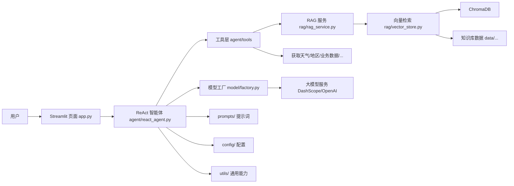

# 智能机器人客服

## 项目介绍

一个基于Streamlit（用于创建交互式Web应用的Python库） + Langchain（用于构建智能体客服），用于回答用户的问题。
RAG（Retrieval-Augmented Generation）模块用于增强智能体的检索能力，提供更准确的回答。

## 项目启动

### 配置系统环境变量

- `OPENAI_API_KEY`
- `DASHSCOPE_API_KEY`: DashScope API 密钥，用于访问模型服务。

### 安装依赖和启动项目

```
uv sync   # 安装依赖
uv run streamlit run app.py  # 启动项目
```

## 项目结构

```text
zstAgent/
├── app.py                    # Streamlit 入口，负责启动 Web 应用
├── agent/                    # 智能体核心逻辑
│   ├── react_agent.py        # ReAct 智能体构建与流程编排
│   └── tools/                # 智能体可调用工具
├── rag/                      # RAG 检索增强模块
│   ├── rag_service.py        # 检索与回答生成服务
│   └── vector_store.py       # 向量库读写与检索封装
├── model/                    # 模型创建与管理
│   └── factory.py            # LLM/Embedding 模型工厂
├── prompts/                  # 提示词模板
│   ├── main_prompt.txt       # 主对话提示词
│   ├── rag_summarize.txt     # RAG 摘要提示词
│   └── report_prompt.txt     # 报告生成提示词
├── config/                   # 配置文件目录（智能体、RAG、提示词等）
│   ├── agent.yml             # 智能体配置
│   ├── chroma.yml            # 向量库配置
│   ├── prompts.yml           # 提示词配置
│   └── rag.yml               # RAG 参数配置
├── utils/                    # 通用工具函数（配置、日志、文件、路径等）
│   ├── config_handler.py     # 配置读取与解析
│   ├── file_handler.py       # 文件处理工具
│   ├── logger_handler.py     # 日志工具
│   ├── path_tool.py          # 路径处理工具
│   └── prompt_loader.py      # 提示词加载工具
├── data/                     # 知识库与业务数据
└── pyproject.toml            # Python 项目依赖与元信息配置
```

## 系统架构



## 补充说明

- 配置入口在 `config/`，可按需调整模型、RAG 与提示词参数
- 知识库文件放在 `data/`，更新后可重新构建向量库以生效
- 核心对话流程：`app.py` → `agent/react_agent.py` → `rag/rag_service.py` → `model/factory.py`
