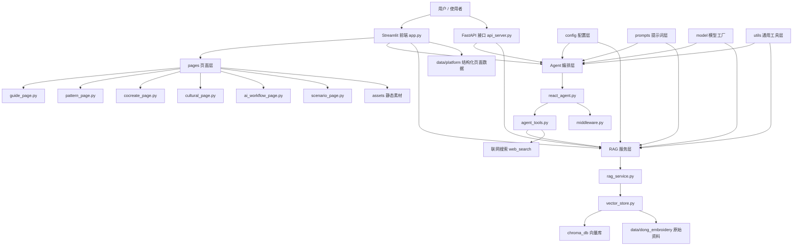
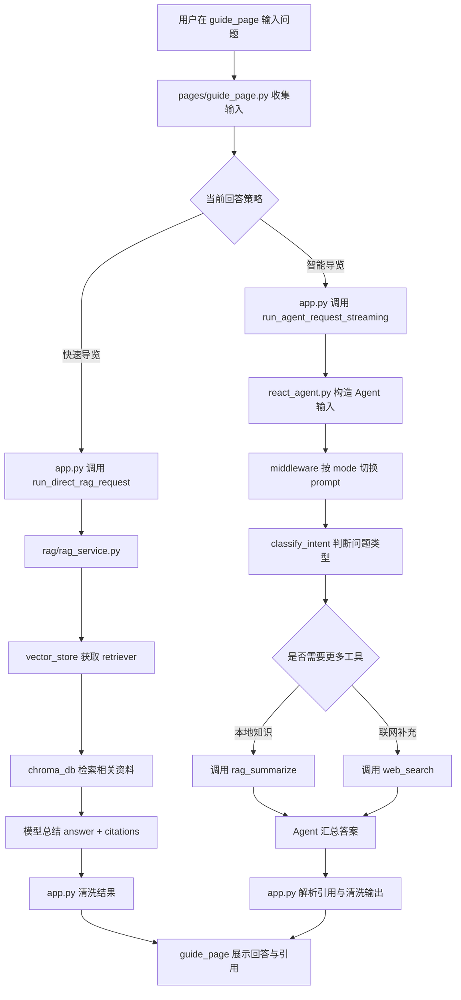
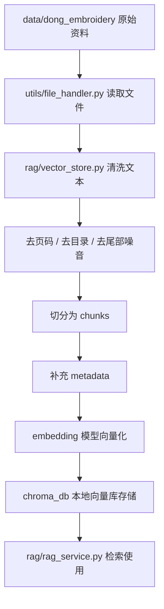
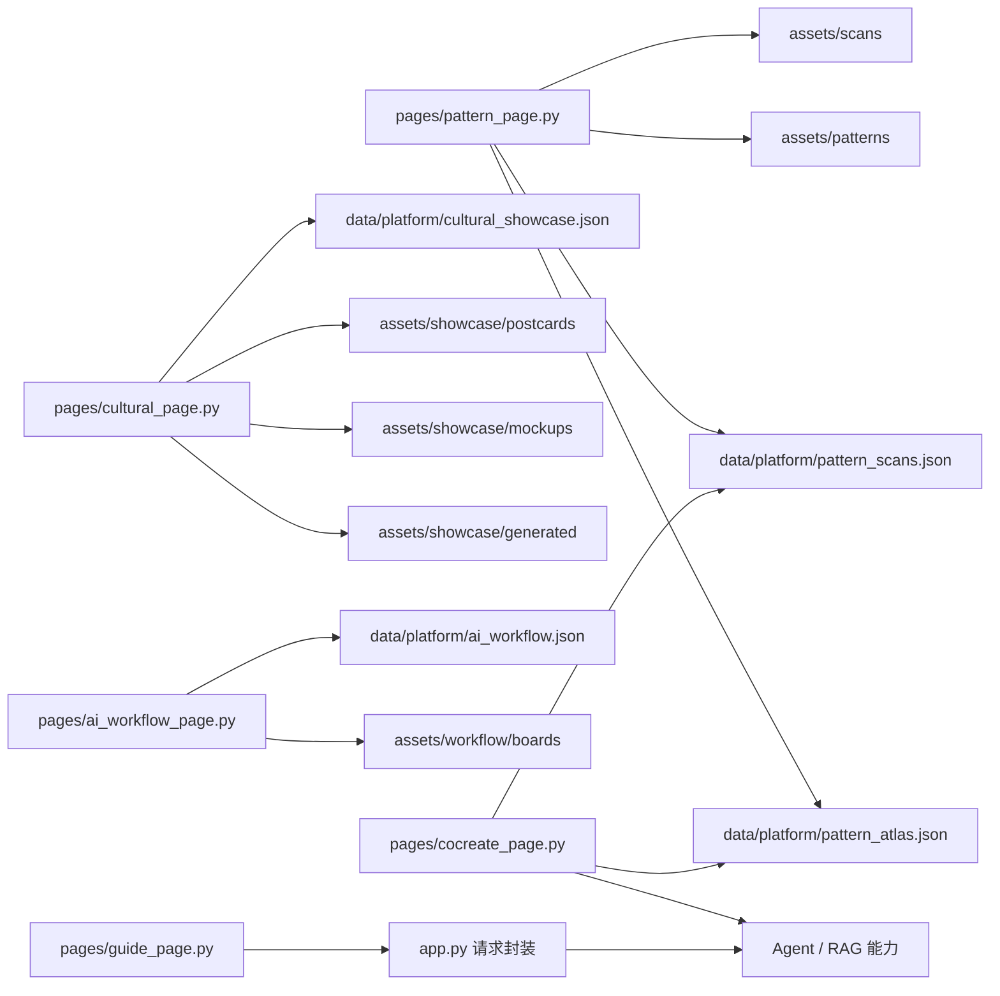

# wxyAgent 项目结构与调用关系说明文档

## 一、项目概述

`wxyAgent` 是一个围绕侗族刺绣/织绣纹样构建的垂直领域 AI 应用项目，整体技术栈以 `Streamlit + LangChain + RAG` 为核心，同时补充了 `FastAPI` 接口、Chroma 本地向量库、提示词体系与多页面展示结构。

从真实文件结构来看，这个项目并不是单一功能网页，而是一套较完整的“知识理解 + 导览问答 + 设计转化 + 场景表达”系统。它主要包含以下几类能力：

1. **纹样图谱展示**：展示侗绣典型纹样卡片与真实刺绣扫图。
2. **文化导览问答**：面向观众或研究者进行知识讲解、展签生成、FAQ 输出等。
3. **本地知识库检索**：基于侗绣研究论文、PDF、DOCX 等资料构建向量知识库，并进行引用式回答。
4. **Agent 智能编排**：根据问题类型智能决定回答模式、工具调用和联网策略。
5. **设计工作台**：将纹样理解进一步转化为文创设计提案、包装方向、海报方向等结构化内容。
6. **成果展示与场景落地**：展示文创样机、生成图以及项目未来落地到展馆、课堂、文旅、品牌合作等场景的方式。

---

## 二、项目根目录文件说明

### `app.py`
项目的 Streamlit 主入口文件，也是当前最核心的运行入口。主要负责：

- 配置页面标题、布局、全局样式
- 定义页面导航与首页内容
- 加载 `data/platform/` 中的结构化 JSON 数据
- 初始化 `ReactAgent` 与 `RagSummarizeService`
- 封装直连 RAG 与 Agent 两种请求方式
- 清洗模型输出、提取引用、合并网页补充来源
- 调用 `pages/` 下各页面渲染函数

它是整个前端应用的“总控文件”。

### `api_server.py`
FastAPI 服务入口。将项目能力以 API 的形式暴露出来，主要包括：

- 健康检查接口
- 平台内容接口
- 导览问答接口
- 设计工作台提案生成接口

适合后续接 Web 前端、小程序或其他客户端。

### `main.py`
当前内容较简单，仅包含一个基础输出函数。它不是当前项目的核心运行入口，更像早期模板或占位文件。

### `README.md`
项目说明文档，主要介绍：

- 环境要求
- 安装与运行方式
- 知识库构建方式
- 项目目录结构概览

### `pyproject.toml`
项目依赖配置文件，定义了运行项目所需的 Python 依赖，例如：

- `streamlit`
- `langchain`
- `chromadb`
- `fastapi`
- `dashscope`
- `pypdf`
- `python-docx`

### `uv.lock`
依赖锁文件，用于锁定安装版本，保证不同环境中依赖一致。

### `PROJECT_GLOBAL_OUTLINE.md`
项目表达与结构规划文档，用于统一项目定位、赛道表达、页面职责和后续资源纳入方式，不直接参与代码运行。

### `failed_files.txt`
构建知识库时未能成功读取的知识文件清单，由 `rag/vector_store.py` 自动维护。

### `md5.text`
记录已经进入知识库的文件 MD5 值，用于去重，避免重复入库。

### `侗族服饰与广西民族刺绣展牌文字整理.docx`
项目附加资料文件，属于原始研究与展牌文字素材的一部分。

### `.python-version`
Python 版本标记文件。

### `.gitignore`
Git 忽略规则文件。

---

## 三、目录结构与职责说明

## 3.1 `agent/`：Agent 智能编排层

该目录负责“智能导览”模式下的任务理解、工具调用和回答组织，是项目中高于普通 RAG 的调度层。

### `agent/react_agent.py`
定义 `ReactAgent` 类，是 Agent 的主执行器。主要职责包括：

- 调用 LangChain 的 `create_agent` 创建 Agent
- 注册工具集
- 注入系统提示词
- 注入中间件
- 根据是否允许联网，区分使用联网版 Agent 或本地版 Agent
- 对外提供 `execute_stream()` 流式执行接口

它是 `app.py` 与 `api_server.py` 在 Agent 模式下的直接依赖对象。

### `agent/tools/agent_tools.py`
定义 Agent 工具集，主要工具包括：

- `classify_intent`：识别用户问题属于导览、展签、研究、设计等哪类任务
- `rag_summarize`：调用本地知识库进行检索与总结
- `web_search`：联网搜索公开网页信息
- `fetch_exhibit`：展品/条目检索能力，当前使用感较弱
- `handoff_to_human`：在资料不足时提供保守兜底

该文件可以理解为 Agent 的“工具箱”。

### `agent/tools/middleware.py`
提供 Agent 中间件逻辑，主要作用包括：

- 按 `mode` 动态切换不同任务提示词
- 记录工具调用日志
- 在模型调用前记录消息状态
- 在必要时向运行时上下文追加追踪信息

这个目录与 `prompts/`、`utils/logger_handler.py`、`utils/prompt_loader.py` 密切相关。

---

## 3.2 `rag/`：检索增强生成层

该目录是本地知识库问答能力的核心实现层。

### `rag/rag_service.py`
定义 `RagSummarizeService`，负责项目中最关键的本地知识库问答逻辑，主要包括：

- 获取向量检索器
- 对用户 query 做 rewrite
- 提取关键词与识别问题重心
- 调用向量检索器获取候选文档
- 根据问题类型对结果进行排序调整
- 使用提示词和模型生成总结结果
- 返回结构化输出，包括：
  - `answer`
  - `citations`
  - `retrieval`
  - `confidence`

该文件既被直连 RAG 模式使用，也被 Agent 工具 `rag_summarize` 间接调用。

### `rag/vector_store.py`
知识库构建核心模块，负责：

- 读取 `data/dong_embroidery/` 下的原始文档
- 解析 PDF、TXT、DOCX 文件
- 清洗文本内容，例如去除页码、目录线、尾部参考文献噪音等
- 切分文本为 chunk
- 为每个 chunk 增加 region、topic、keywords、page 等 metadata
- 使用 embedding 模型生成向量
- 将向量和 metadata 写入 Chroma 本地知识库
- 支持 HNSW 索引损坏后的自动重建
- 维护 `md5.text` 与 `failed_files.txt`

它是整个项目中“知识库底座”的核心实现。

### `rag/ingest_compare.py`
用于入库效果对比或实验分析的脚本，不属于当前主业务流程。

### `rag/ingest_compare_report.json`
与 `ingest_compare.py` 对应的分析结果文件。

### `rag/rerank_eval.py`
用于重排序评估的实验性脚本，当前并非主流程核心。

---

## 3.3 `model/`：模型工厂层

### `model/factory.py`
统一创建和导出模型对象，主要包括：

- `chat_model`
- `embed_model`

模型配置来自 `config/rag.yml`。根据当前文件内容，项目使用：

- 聊天模型：`qwen3-max`
- 向量模型：`text-embedding-v4`

该文件被 `rag/` 与 `agent/` 共同依赖。

---

## 3.4 `utils/`：通用工具层

### `utils/config_handler.py`
统一加载 YAML 配置文件，包括：

- `config/rag.yml`
- `config/chroma.yml`
- `config/prompts.yml`
- `config/agent.yml`

### `utils/prompt_loader.py`
统一加载提示词文件，并对外提供：

- `load_system_prompt()`
- `load_rag_prompts()`
- `load_guide_prompt()`
- `load_label_prompt()`
- `load_research_prompt()`
- `load_faq_prompt()`
- `load_report_prompt()`

### `utils/file_handler.py`
负责知识文件的底层处理，主要功能包括：

- 遍历指定类型文件
- 计算文件 MD5
- 加载 PDF/TXT/DOCX
- PDF 解析失败时尝试 TXT 或 DOCX 兜底

### `utils/logger_handler.py`
项目日志系统，负责：

- 初始化统一 logger
- 输出控制台日志
- 写入 `logs/agent_日期.log`

### `utils/path_tool.py`
路径工具，统一获取项目根目录与绝对路径，避免各处手动拼接路径。

---

## 3.5 `config/`：配置层

### `config/rag.yml`
配置模型名称：

- `chat_model_name`
- `embedding_model_name`

### `config/chroma.yml`
配置向量知识库和分块参数，包括：

- `collection_name`
- `persist_directory`
- `k`
- `data_path`
- `md5_hex_store`
- `allow_knowledge_file_type`
- `chunk_size`
- `chunk_overlap`
- `separators`

### `config/prompts.yml`
配置所有提示词文件路径。

### `config/agent.yml`
当前配置项较少，更偏预留或兼容使用。

---

## 3.6 `prompts/`：提示词层

### `prompts/main_prompt.txt`
Agent 主系统提示词，定义了：

- 问题分析规则
- 工具调用原则
- 本地知识优先策略
- 联网补充条件
- 引用输出格式

### `prompts/guide_prompt.txt`
导览模式提示词，用于输出更适合观众理解的讲解型答案。

### `prompts/label_prompt.txt`
展签模式提示词，用于输出适合展牌使用的简洁文案。

### `prompts/research_prompt.txt`
研究模式提示词，用于生成更偏资料型、比较型、研究型输出。

### `prompts/faq_prompt.txt`
FAQ 模式提示词，用于将内容组织成观众常见问题的形式。

### `prompts/rag_summarize.txt`
RAG 总结链提示词，约束模型仅基于检索资料生成回答。

### `prompts/report_prompt.txt`
报告生成提示词，当前主流程中使用较少。

---

## 3.7 `pages/`：当前主用页面层

该目录是当前 Streamlit 真正使用的页面实现目录。

### `pages/guide_page.py`
文化导览页，主要负责：

- 展示导览设置
- 提供示例问题
- 接收用户输入
- 展示对话历史
- 控制模式、策略、受众、引用开关和联网开关
- 调用 Agent 或直连 RAG 请求函数
- 展示引用信息和删除历史对话

### `pages/pattern_page.py`
纹样图谱页，主要负责：

- 展示典型纹样图谱卡片
- 展示真实刺绣扫图
- 提供筛选能力
- 支持跳转到导览页继续追问
- 支持跳转到共创页生成设计提案

### `pages/cultural_page.py`
文创展陈页，主要负责展示：

- 平面成果
- 产品样机
- AIGC 生成延展图

页面数据来自 `data/platform/cultural_showcase.json`。

### `pages/cocreate_page.py`
设计工作台页，主要负责：

- 选择纹样、设计方向、风格和补充要求
- 读取图谱卡片与关联扫图信息
- 构造结构化设计提案 prompt
- 调用 RAG 或 Agent 输出设计提案结果

### `pages/ai_workflow_page.py`
AI 工作流页，主要负责展示：

- 知识库构建方式
- RAG 与 Agent 的工作链路
- 平台价值、对比优势和输出场景

页面数据来自 `data/platform/ai_workflow.json`。

### `pages/scenario_page.py`
场景落地页，主要负责表达：

- 项目可落地的真实场景
- 面向 B 端与 C 端的潜在用户
- 文创合作方向
- 角色/IP 传播路径

### `pages/__init__.py`
对外导出页面层中一些可复用的常量与函数，例如：

- `build_cocreate_query`
- `GUIDE_SAMPLE_QUESTIONS`
- `MODE_MAP`
- 场景页常量列表

---

## 3.8 `modules/`：旧版或过渡页面目录

该目录中也存在与 `pages/` 类似的页面实现，例如：

- `guide_page.py`
- `pattern_page.py`
- `cultural_page.py`
- `ai_workflow_page.py`
- `scenario_page.py`
- `home_page.py`

但从当前 `app.py` 的导入关系看，主入口实际使用的是 `pages/`，因此 `modules/` 更适合被理解为：

- 旧版页面实现
- 重构前遗留代码
- 备用或过渡模块

在分析当前项目时，应优先以 `pages/` 为准。

---

## 3.9 `data/`：数据层

### `data/dong_embroidery/`
项目本地知识库的原始资料目录，存放：

- 侗绣纹样研究论文 PDF
- 设计转化相关研究资料
- 审美与文化内涵研究文档
- DOCX/PDF 格式的补充资料

这些文档是项目 RAG 知识库的最上游数据源。

### `data/platform/`
当前页面主用的结构化 JSON 数据目录，包括：

- `pattern_atlas.json`：纹样图谱卡片数据
- `pattern_scans.json`：真实扫图数据
- `cultural_showcase.json`：文创成果数据
- `ai_workflow.json`：AI 工作流页展示数据

### `data/ui/`
包含与图谱有关的 JSON 数据副本，但当前主代码使用较少，更像旧版或备用数据目录。

---

## 3.10 `assets/`：静态资源层

### `assets/patterns/`
纹样图谱图片资源，对应 `pattern_atlas.json` 中的 `image` 字段。

### `assets/scans/`
真实刺绣扫图资源，对应 `pattern_scans.json` 中的 `image` 字段。

### `assets/showcase/`
文创成果图片资源，分为：

- `postcards/`
- `mockups/`
- `generated/`

与 `cultural_showcase.json` 中的数据项一一对应。

### `assets/workflow/boards/`
AI 工作流页中的展板图片资源。

---

## 3.11 其他目录

### `chroma_db/`
Chroma 本地向量数据库持久化目录，是 RAG 检索的底层数据存储位置。

### `logs/`
项目日志目录，由 `utils/logger_handler.py` 自动写入。

### `images 博物馆实拍素材/`
博物馆实拍照片素材目录，当前主页面中尚未大规模接入，但属于项目真实素材储备。

---

## 四、文件之间的关系与依赖链

## 4.1 知识库构建链路

```text
config/chroma.yml
    ↓
utils/file_handler.py + utils/path_tool.py
    ↓
rag/vector_store.py
    ↓
data/dong_embroidery/*
    ↓
chroma_db/
```

说明：

- `config/chroma.yml` 提供数据目录、切块参数与存储目录
- `utils/file_handler.py` 提供文件读取能力
- `rag/vector_store.py` 将原始资料清洗后写入 `chroma_db/`

---

## 4.2 RAG 问答链路

```text
用户问题
    ↓
rag/rag_service.py
    ↓
rag/vector_store.py 提供 retriever
    ↓
chroma_db/ 检索相关 chunk
    ↓
model/factory.py 提供 chat_model
    ↓
prompts/rag_summarize.txt
    ↓
输出 answer + citations + retrieval + confidence
```

说明：

- `rag_service.py` 是本地知识库问答的核心服务
- 它依赖向量检索结果与总结提示词
- 最终输出结构化结果，供页面或 Agent 使用

---

## 4.3 Agent 调用链路

```text
用户问题
    ↓
agent/react_agent.py
    ↓
agent/tools/middleware.py 按 mode 切换 prompt
    ↓
agent/tools/agent_tools.py 调用工具
    ├── classify_intent
    ├── rag_summarize
    ├── web_search
    └── 其他工具
    ↓
model/factory.py 提供模型
    ↓
输出 Agent 组织后的结果
```

说明：

- Agent 并不替代 RAG，而是把 RAG 作为关键工具之一
- Agent 更侧重任务理解、模式切换、工具编排和回答组织

---

## 4.4 页面展示链路

```text
app.py
    ↓
pages/*
    ↓
data/platform/*.json
    ↓
assets/*
    ↓
页面展示结果
```

说明：

- `app.py` 是 Streamlit 页面调度中心
- `pages/` 负责各页面实际渲染
- `data/platform/` 提供结构化内容
- `assets/` 提供展示图片与静态资源

---

## 五、从用户提问到最终回答的调用流程

项目在文化导览页中支持两种主要回答路径：

1. **快速导览（直连 RAG）**
2. **智能导览（Agent）**

---

## 5.1 快速导览（直连 RAG）路径

调用过程如下：

```text
用户在 pages/guide_page.py 输入问题
    ↓
pages/guide_page.py 读取模式、策略、受众等参数
    ↓
app.py 调用 run_direct_rag_request
    ↓
rag/rag_service.py 检索并总结
    ↓
返回 answer + citations
    ↓
app.py 清洗结果
    ↓
pages/guide_page.py 展示回答与引用
```

适用场景：

- 普通知识问答
- 快速导览
- 不需要复杂工具判断的场景

特点：

- 路径短
- 响应快
- 主要基于本地知识库回答

---

## 5.2 智能导览（Agent）路径

调用过程如下：

```text
用户在 pages/guide_page.py 输入问题
    ↓
pages/guide_page.py 读取模式、策略、受众、联网开关等参数
    ↓
app.py 调用 run_agent_request_streaming
    ↓
agent/react_agent.py 构造 Agent 输入与上下文
    ↓
agent/tools/middleware.py 根据 mode 切换 prompt
    ↓
Agent 调用 classify_intent 判断任务类型
    ↓
按需调用 rag_summarize / web_search / 其他工具
    ↓
Agent 汇总生成答案
    ↓
app.py 清洗工具回显与 JSON 噪音
    ↓
pages/guide_page.py 展示最终结果与引用
```

适用场景：

- 展签文案生成
- FAQ 生成
- 深度研究说明
- 需要多工具编排的复杂导览任务

特点：

- 更灵活
- 支持按模式切换不同 prompt
- 必要时支持联网补充
- 更适合复杂任务

---

## 六、页面、数据和素材之间的映射关系

### `pages/pattern_page.py`
对应：

- `data/platform/pattern_atlas.json`
- `data/platform/pattern_scans.json`
- `assets/patterns/`
- `assets/scans/`

### `pages/cultural_page.py`
对应：

- `data/platform/cultural_showcase.json`
- `assets/showcase/postcards/`
- `assets/showcase/mockups/`
- `assets/showcase/generated/`

### `pages/ai_workflow_page.py`
对应：

- `data/platform/ai_workflow.json`
- `assets/workflow/boards/`

### `pages/cocreate_page.py`
依赖：

- `data/platform/pattern_atlas.json`
- `data/platform/pattern_scans.json`
- Agent / RAG 能力

### `pages/guide_page.py`
依赖：

- `app.py` 封装的请求函数
- Agent / RAG 返回的结构化结果
- 引用数据结构

---

## 七、当前主用模块与非主用模块判断

### 当前主用模块

- `app.py`
- `api_server.py`
- `pages/`
- `agent/`
- `rag/`
- `model/`
- `utils/`
- `config/`
- `prompts/`
- `data/platform/`
- `data/dong_embroidery/`
- `assets/`
- `chroma_db/`

### 非主用 / 辅助 / 实验性模块

- `modules/`
- `data/ui/`
- `main.py`
- `rag/ingest_compare.py`
- `rag/rerank_eval.py`
- `images 博物馆实拍素材/`

---

## 八、总结

从项目真实文件结构来看，`wxyAgent` 可以分为以下几层：

1. **展示层**：`app.py`、`pages/`、`assets/`、`data/platform/`
2. **知识层**：`data/dong_embroidery/`、`rag/vector_store.py`、`chroma_db/`
3. **问答层**：`rag/rag_service.py`
4. **智能编排层**：`agent/`
5. **基础支撑层**：`model/`、`utils/`、`config/`、`prompts/`
6. **接口层**：`api_server.py`

这个项目的核心价值不在于某一个单独页面，而在于它把以下能力串成了完整链路：

- 纹样知识整理
- 本地知识库构建
- RAG 检索增强
- Agent 智能导览
- 设计提案生成
- 场景化表达

如果从项目表达角度概括，可以将其理解为：

> 一个围绕侗族刺绣纹样展开的“知识理解 + AI 导览 + 设计转化 + 场景落地”的垂直领域 AI 辅助设计平台。

---

## 九、项目架构图与调用流程图

## 9.1 项目整体架构图



### 图示说明

这张图体现了项目的六层结构：

1. **入口层**：`app.py` 与 `api_server.py`
2. **页面层**：`pages/` 下各页面
3. **智能编排层**：`agent/`
4. **检索增强层**：`rag/`
5. **数据与素材层**：`data/`、`assets/`、`chroma_db/`
6. **基础支撑层**：`config/`、`prompts/`、`model/`、`utils/`

---

## 9.2 用户在导览页提问时的调用流程图



### 图示说明

这张图把导览页的两条主路径区分开了：

- **快速导览**：直接走本地 RAG，路径更短，响应更快
- **智能导览**：先进入 Agent，再决定调用哪些工具，更适合复杂问题

---

## 9.3 本地知识库构建流程图



### 图示说明

这张图强调的是：

- 侗绣论文和资料不是直接给模型看
- 而是先经过清洗、切分、向量化
- 再进入 `chroma_db/` 供后续问答检索使用

---

## 9.4 页面、数据和素材映射图



### 图示说明

这张图适合解释“页面不是写死内容，而是从 JSON 数据和素材目录中拼装出来的”。

---

## 十、文档使用建议

这份文档可以直接用于以下场景：

1. **项目答辩材料底稿**：帮助梳理项目结构与模块关系
2. **团队交接文档**：帮助新成员快速理解目录分工
3. **代码阅读入口文档**：帮助先看结构，再看实现细节
4. **比赛/面试说明材料**：用于说明项目并非单纯页面展示，而是具备知识库、Agent 与设计工作台的完整系统

如果后续项目继续扩展，建议优先同步更新以下章节：

- 第二章：根目录文件说明
- 第三章：目录结构与职责说明
- 第六章：页面、数据和素材映射关系
- 第九章：架构图与调用流程图
